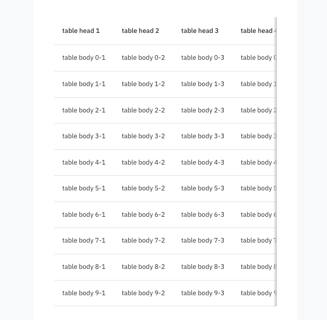
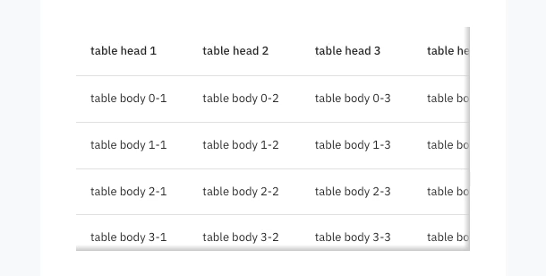
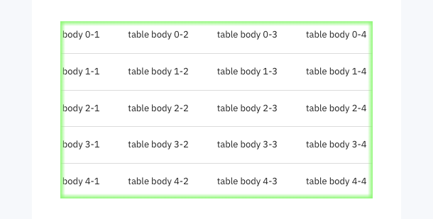
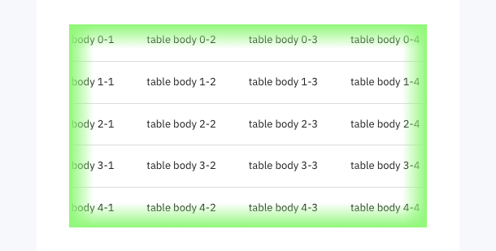

## Demo






## Project

A component that adds a fog effect to indicate scrollability to overflowed components.

## Getting Started

```
npm i react-fog
```

## Usage 1 - X-axis scroll fog effect

```
import Fog from 'react-fog';

const LargeWidthComp = () => {
  return (
    <Fog> // width: "100%", overflow: "auto"
      <LargeWidth/>
    </Fog>
  )
};
```

## Usage 2 - X-axis, Y-axis scroll fog effect

```
import Fog from 'react-fog';

const LargeWidthComp = () => {
  return (
    <Fog height={300}> // width: "100%", height: "300px", overflow: "auto"
      <LargeWidthAndLargeHeight/>
    </Fog>
  )
};
```

## Usage 3 - Change Fog color

```
import Fog from 'react-fog';

const LargeWidthComp = () => {
  return (
    <Fog fogColor="#0af373" height={300}>
      <LargeWidthAndLargeHeight/>
    </Fog>
  )
};
```

## Usage 4 - Change Fog range

```
import Fog from 'react-fog';

const LargeWidthComp = () => {
  return (
    <Fog fogRange={25} height={300}> // 25px, default 7px
      <LargeWidthAndLargeHeight/>
    </Fog>
  )
};
```

## Usage 5 - Width MUi Table example

```
import Fog from 'react-fog';
import { Table, TableBody, TableCell, TableHead, TableRow } from "@mui/material";
import _ from "lodash";

const FogTable = () => {
  return (
    <Fog fogColor="#98fa7a" fogRange={30} height={250}>
      <Table>
        <TableHead>
          <TableRow>
            {_.range(0, 7).map((i) => (
              <TableCell key={`table-head-${i}`} width={200}>
                table head {i}
              </TableCell>
            ))}
          </TableRow>
        </TableHead>
        <TableBody>
          {_.range(0, 15).map((i) => (
            <TableRow key={`row-${i}`}>
              <TableCell width={200}>table body {i}-1</TableCell>
              <TableCell width={200}>table body {i}-2</TableCell>
              <TableCell width={200}>table body {i}-3</TableCell>
              <TableCell width={200}>table body {i}-4</TableCell>
              <TableCell width={200}>table body {i}-5</TableCell>
              <TableCell width={200}>table body {i}-6</TableCell>
              <TableCell width={200}>table body {i}-7</TableCell>
            </TableRow>
          ))}
        </TableBody>
      </Table>
    </Fog>
  )
};
```

## LICENSE

This project is licensed under the MIT License. See the [LICENSE](LICENSE) file for details.

## Need Help?

Have questions or issues? Please open an [issue](https://github.com/dohyun2im/react-fog/issues).
