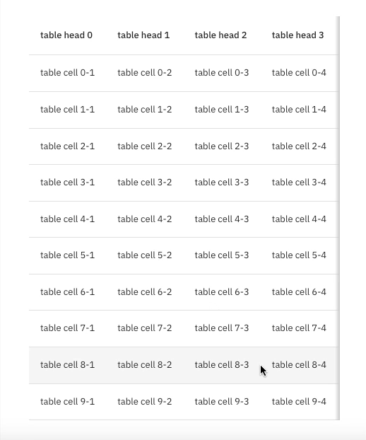
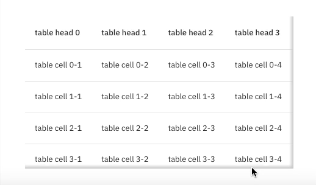
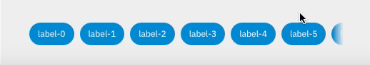

# react-fog

[](https://badge.fury.io/js/react-fog)

[](https://www.npmjs.com/package/react-fog)

A component that adds a fog effect to indicate scrollability to overflowed components.






## Getting Started

```
npm i react-fog
```

## Usage

```tsx
import Fog from 'react-fog';

const Example = () => {
  return (
    <Fog height={300} fogRange={12} fogColor="#0af373" fogZIndex={10}>
      <LargeWidthAndLargeHeight />
    </Fog>
  );
};
```

## Props

| Prop | Type | Default | Description |
| --- | --- | --- | --- |
| `fogRange` | `number` | `7` | Fog thickness in pixels. |
| `fogColor` | `string` | `rgb(199, 199, 199)` | Fog gradient color. |
| `height` | `number` | `undefined` | Scroll container height in pixels. |
| `fogZIndex` | `number` | `999` | z-index for fog overlay layers. |
| `children` | `React.ReactNode` | `-` | Scrollable content. |

## LICENSE

This project is licensed under the MIT License. See the [LICENSE](LICENSE) file for details.

## Need Help?

Have questions or issues? Please open an [issue](https://github.com/fe-dudu/react-fog/issues).
